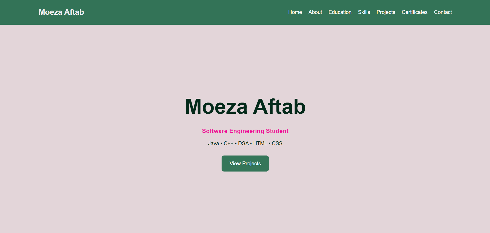
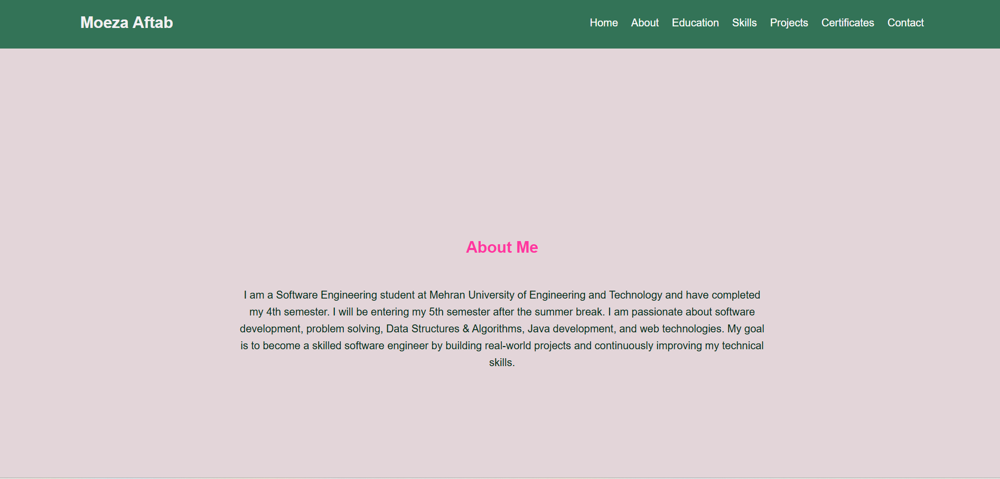
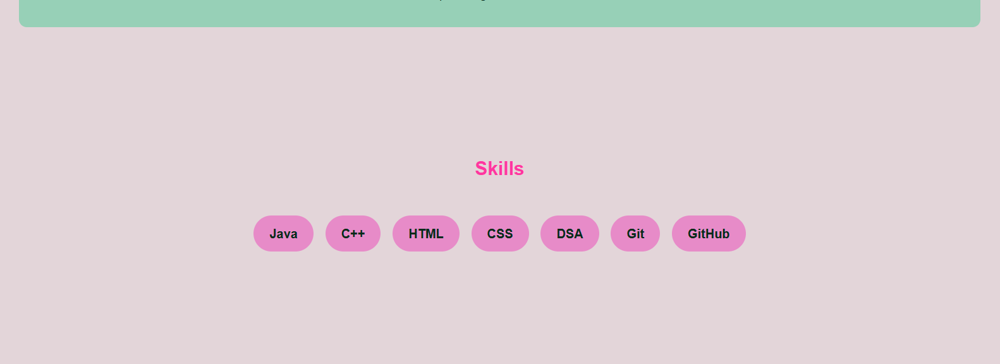
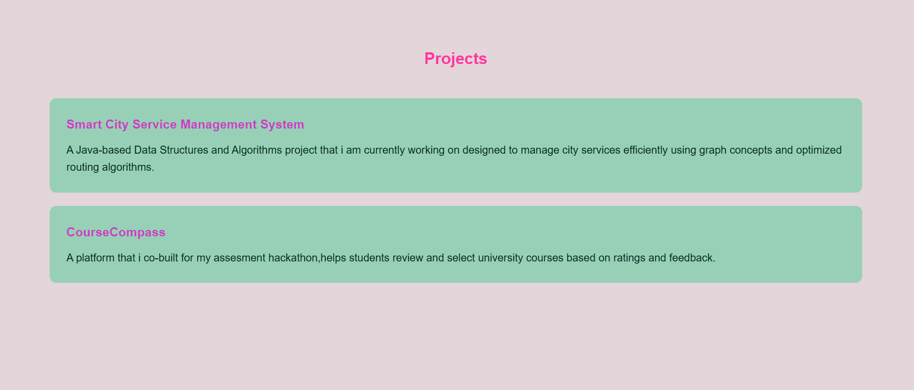
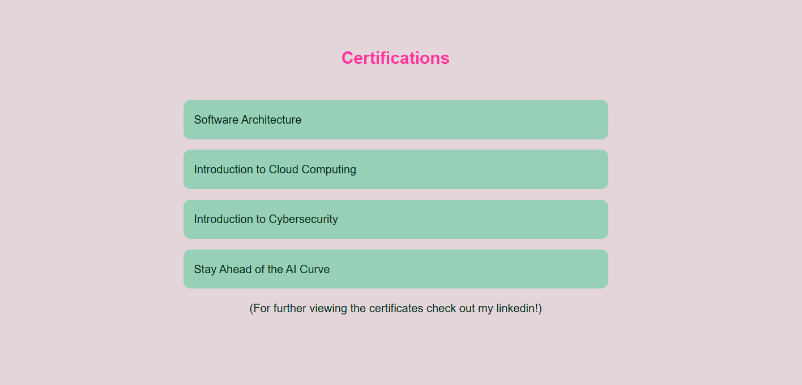

# Personal Portfolio Website

A responsive personal portfolio website developed using **HTML5** and **CSS3** to showcase my skills, projects, certifications, and academic background as a Software Engineering student.

## About

This portfolio represents my journey as an aspiring software engineer. I built it to strengthen my frontend development skills while creating a professional online presence for internship and career opportunities. The website highlights my technical skills, projects, certifications, and contact information in a clean and organized layout.

## Technologies Used

- HTML5
- CSS3

## Features

- Responsive and user-friendly design
- Clean and organized interface
- Navigation bar for easy access to sections
- About Me section
- Education section
- Technical Skills section
- Projects showcase
- Certifications section
- Contact information with GitHub and LinkedIn links

## Project Goals

- Practice frontend web development fundamentals
- Improve HTML and CSS skills through hands-on development
- Learn how to structure and organize a real-world website
- Build a professional portfolio for internship applications
- Strengthen Git and GitHub version control skills

## Future Improvements

As I continue learning modern web development, I plan to enhance this project by adding:

- JavaScript interactivity
- React.js version
- Dark mode
- Animations and smoother transitions
- Contact form with backend integration
- Additional projects and certifications

## Repository Structure

My_Portfolio/
│
├── portfolio.html
├── style.css
├── images/
└── README.md

## Screenshots
### Home

### About

### Education

### Skills

### Projects

### Certifications

### Contact

## Live Demo

*Coming soon.*

## Connect With Me

**LinkedIn:** https://www.linkedin.com/in/moeza-aftab

**GitHub:** https://github.com/MoezaAftab

**Email:**moezaaftab1@gmail.com

---

⭐ Thank you for visiting my portfolio! Feedback and suggestions are always welcome.
